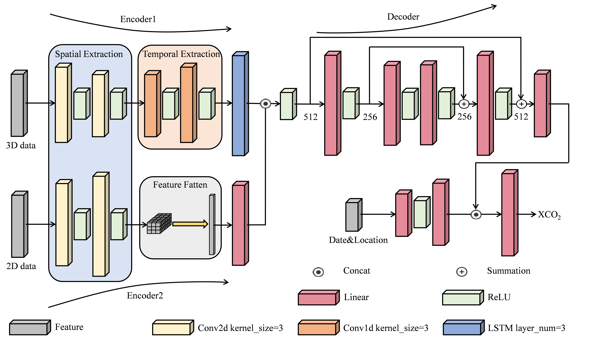

# <center> Full-Coverage Mapping of Daily High-Resolution XCO2 across China from 2015 to 2020 by Deep Learning-Based Spatio-Temporal Fusion </center>

**[Paper info: https://doi.org/10.1109/TGRS.2025.3540289](https://doi.org/10.1109/TGRS.2025.3540289)**


## Quick View



## Dataset Introduction

This paper introduces the Daily 0.1° high-resolution XCO2 dataset for China from 2015 to 2020. This dataset provides daily, high-resolution (0.1° spatial resolution) XCO2 data for China, generated using a deep learning-based spatio-temporal fusion model (DSTM). The model integrates multiple data sources, including satellite observations from OCO-2 and CarbonTracker, as well as data on atmospheric transport, carbon emissions, and carbon sinks. This dataset offers comprehensive and continuous XCO2 data coverage across China, facilitating detailed analyses of carbon cycle dynamics and supporting policy adjustments for carbon neutrality.

### **Dataset Access**

You can access and download the dataset from the Science Data Bank using the following link:
**[Daily 0.1° high-resolution XCO2 dataset, China 2015-2020](https://www.scidb.cn/en/s/uuUVJb)**

## Usage

### Perpare
- **Python environment**  
You need to install the following libraries: *pytorch, gdal, numpy, pandas, sklearn, scipy*.
```bash
conda create -n DSTM python=3.9

# Recommend installing according to the official PyTorch method.(Don't use the following)
conda install pytorch=1.13

conda install gdal=3.3.3
```

- **Training data**  
  To generate the required training files, use the *ExtractMultiValuesToPoints.py* script located in the tool folder (a shapefile of the Chinese region and multi-source TIFF files are required). Subsequently, calculate the mean and standard deviation of the resulting .npy files and provide these statistics to *dataset.py* for data normalization. Finally, train the model using the *trainPatch.py* script and perform predictions and validation with the *predict.py* script.

## Contact
 🙋 If you have any question or want to use the code, please contact yanjn@cug.edu.cn

 🌟 If you find this resource helpful, please consider to star this repository and cite our research.  
```
@ARTICLE{Yan2025F,
  author={Li, Yi and Yan, Jining and Zhong, Liheng and Bao, De and Sun, Leigang and Li, Guangyu},
  journal={IEEE Transactions on Geoscience and Remote Sensing}, 
  title={Full-Coverage Mapping of Daily High-Resolution XCO2 across China from 2015 to 2020 by Deep Learning-Based Spatio-Temporal Fusion}, 
  year={2025},
  volume={},
  number={},
  pages={1-1},
  keywords={Spatio-temporal fusion;CarbonTracker;daily high-resolution XCO2;full-coverage mapping;OCO-2},
  doi={10.1109/TGRS.2025.3540289}}
```